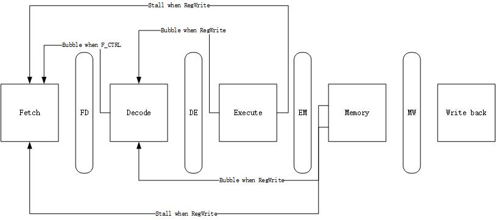
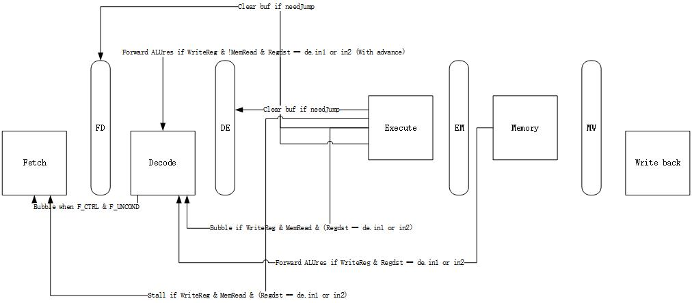

# Part2 Design Document
*13302010017 Guo Liangchen*

---

## Basic multi-cycle processor design

The basic multi-cycle processor is based on the 5 pipeline stages.
1. **Fetch**: update PC and get the instruction from instruction memory.
2. **Decode**: instruction is decoded into control signals for later stages use. Meanwhile, get convert the register number into the corresponding register value.
3. **Execute**: execute the ALU operation based on the control signal and oprand value genarated by decode stage. For control instructions, update the signal `needJump`.
4. **Memory**: read or write data memory according to the control signal.
5. **Write back**: write data from ALU or memory into register according to the control signal.

As in `sim-pipe.h`, the middle stages include the following information:

- **fd**
```c
struct ifid_buf {
  md_inst_t inst;	    /* instruction that has been fetched */
  md_addr_t PC;	        /* pc value of current instruction */
  md_addr_t NPC;		/* the next instruction to fetch */
};
```

- **de**
```c
struct idex_buf {
  md_inst_t inst;		/* instruction in ID stage */
  int opcode;			/* operation number */
  oprand_t oprand;		/* operand */
  int instFlags;
  // Control signals
  ex_ctrl_t ex_ctrl;
  mem_ctrl_t mem_ctrl;
  wb_ctrl_t wb_ctrl;
  // Next PC
  md_addr_t NPC;
  // Output
  sword_t reg1_data;
  sword_t reg2_data;
  sword_t reg3_data;
};
```
- **em**
```c
struct exmem_buf{
  md_inst_t inst;		/* instruction in EX stage */
  mem_ctrl_t mem_ctrl;
  wb_ctrl_t wb_ctrl;
  md_addr_t NPC;
  bool_t needJump;
  sword_t alu_res;
  bool_t alu_zero;
  sword_t reg1_data;
  int reg_dest;
};
```
- **mw**
```c
struct memwb_buf{
  md_inst_t inst;		/* instruction in MEM stage */
  wb_ctrl_t wb_ctrl;
  sword_t alu_res;
  sword_t memread_res;
  int reg_dest;
};
```
For control signals, the data structures are:
```c
typedef struct {
  reg_dst_t RegDst;
  alu_src_t ALUSrc1;
  alu_src_t ALUSrc2;
  alu_op_t ALUOp;
} ex_ctrl_t;

typedef struct {
  bool_t MemRead;
  bool_t MemWrite;
  branch_type_t Branch;
} mem_ctrl_t;

typedef struct {
  bool_t RegWrite;
  bool_t MemtoReg;
} wb_ctrl_t;
```
These control signals are all determined by decode stage, and will not be changed in the future for a single instruction.

---

## Pipeline processor with stalling

The stalling solution will deal with data hazard and control hazard all by stalling pipeline stages.

- For data hazard, there's 2 specific scenarios:
  1. Decode stage waiting for the result of the last instruction. For instance(code 1):

  ```
  add $3, $2, $1  // instruction a
  sub $2, $3, $5  // instruction b
  nop
  nop
  ```

  b relies on the result of a: $3. In the actual pipeline stage, instruction b should wait until a reaches the write back stage.

  if      | id      | ex      | mem      |  wb
  --------|---------|---------|----------|-------------
  **add** | nop | nop | nop | nop
  **sub** | **add** | nop | nop | nop
  nop | **sub** | **add** | nop | nop
  nop | **sub** | nop | **add** | nop
  nop | **sub** | nop | nop | **add**
  nop | nop | **sub** | nop | nop

  2. Decode stage waiting for the result of the one before the last instruction. For instance(code 2):

  ```
  add $3, $2, $1  // instruction a
  and $7, $8, $9
  sub $2, $3, $5  // instruction b
  nop
  ```

  What happens in the pipeline is illustrated below.

  if      | id      | ex      | mem      |  wb
  --------|---------|---------|----------|-------------
  **add** | nop | nop | nop | nop
  and | **add** | nop | nop | nop
  **sub** | and | **add** | nop | nop
  nop | **sub** | and | **add** | nop
  nop | **sub** | nop | and | **add**
  nop | nop | **sub** | nop | and

- For control hazard, we just stall the whole pipeline and waiting for the result of that control instruction. For instance:

  ```
  bne $2, $0, 0x400010 // assume that $2 = 0.
  sub $5, $6, $7
  // Some code
  add $5, $6, $7 // 0x400010, Will jump to this position
  and $8, $9, $10
  ```

    What happens in the pipeline is illustrated below.

    if      | id      | ex      | mem      |  wb
    --------|---------|---------|----------|-------------
    **sub** | **bne** | nop | nop | nop
    **sub** | nop | **bne** | nop | nop
    **add** | nop | nop | **bne** | nop
    and | **add** | nop | nop | **bne**

The three stall solutions is illustrated below:



---
## Pipeline processor with forwarding and branch prediction

- Data forwarding
  1. In the [code1](#user-content-code1) scenario, we forward the ALU result of the instruction a directly to the decode stage of the instruction b.
  2. In the [code2](#user-content-code2) scenario, we forward the ALU result of the instruction a (could be found in the mem stage) to the decode stage of the instruction b.
  3. In the last 2 scenarios, there's no stall in pipeline. But in the following scenario, the pipeline should stall once for waiting the memory read result of the instruction a.

  ```
  lw  $2, $3, 0x40  // instruction a
  add $4, $2, $0    // instruction b
  nop
  nop
  ```
  What happens in the pipeline is illustrated below.

  if      | id      | ex      | mem      |  wb
  --------|---------|---------|----------|-------------
  **add** | **lw** | nop | nop | nop
  nop | **add** | **lw** | nop | nop
  nop | **add** | nop | **lw** | nop
  nop | nop | **add** | nop | **lw**

  We should be clear that if 2 forwardings reached on one reg number in the decode stage at the same time, the execute stage should have the priority for it's the most recent result for forwarding.

- Branch prediction
  1. For unconditional jump (`F_CTRL & F_UNCOND`), there's no need to predict. We just stall the whole pipeline and waiting for the jump address forwarded by execute stage.
  2. For conditional jump, we use "not taken" predicting method. The pipeline operates normally when instruction like `bne` reaches execute stage. If `needJump`, we clean the `fd` and `de` buffer to cancel the wrong instrucitons reached in pipeline.

Above all, the solution of forwarding is illustrated below:


